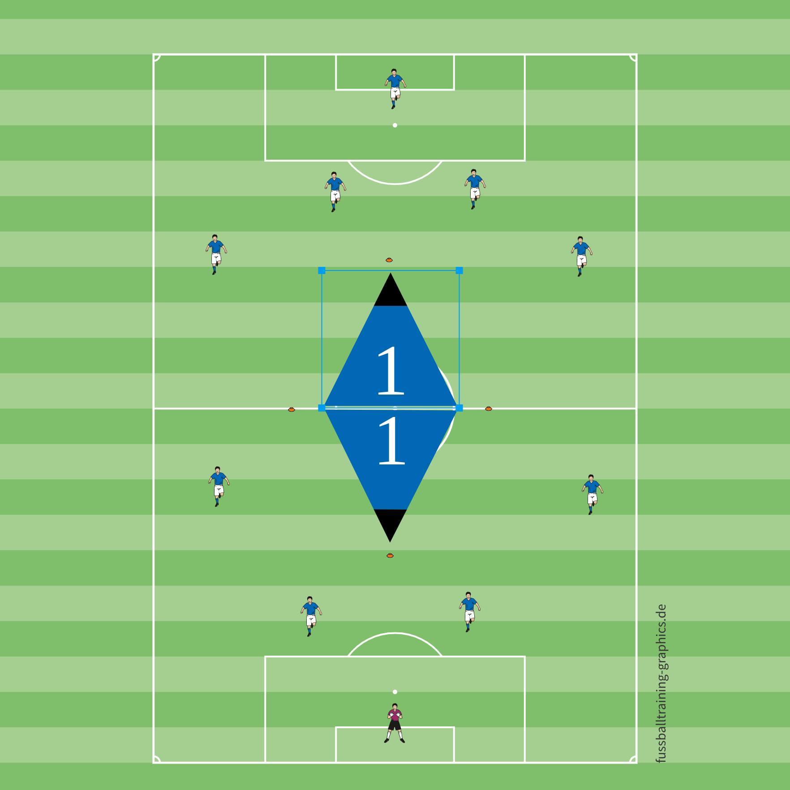

# Trainingsplanung - Thema: Ueber Aussen Angreifen

Name: Weitner Michael

Thema: Trainingsform Spielform 1 ¨Über Aussen Angreifen¨ (Tabuzone)

## Spielform 1

ich habe fuer meine Trainingsplanung eine Spielform zum Thema
"Ueber Aussen Angreifen" gewaehlt.

Bei der Spielform wird ein Kleinfeld mit 28 m Breite und 36 m Laenge
aufgebaut.

- 9 m Abschlusszone - 9 m Mittelzone - Mittellinie - 9 m Mittelzone -
 9 m Abschlusszone

Es wird um den Mittelpunkt eine Raute mit 6 m Breite und 12 m Laenge
als Tabuzone erstellt.

- 4 Huetchen markieren die Ecken der Raute

Es spielen 4 gegen 4 oder 5 gegen 5 mit fliegendem Torwart.

Abbildung: Aufbau der Spielform als Kleinfeld mit Tabuzone.

### Materialbedarf

- 1 Kleinfeld mit einer Groesse von 28 x 36 Metern
- 4 Huetchen fuer die Raute in der Feldmitte
- 8 bis 12 Haeutchen oder Markierungsteller fuer die Feldgrenzen und
 Zonen
- 2 Minitore oder 2 Jugendtore, je nach Aufbau
- 1 bis 2 Baelle
- Leibchen in zwei Farben fuer beide Mannschaften
- Optional: Pfeife und Stoppuhr fuer die Steuerung der Spielform

### Coachingpunkt

- Breite und Tiefe im Spiel herstellen: ballnahe Spieler bieten sich in
  offenen Raeumen an, ballferne Spieler halten das Feld gross.
- Den Ball nicht durch die Tabuzone erzwingen, sondern ueber die
- Aussenraeume verlagern und anschliessend wieder in die Tiefe spielen.
- Vor der Ballannahme offene Koerperstellung einnehmen, damit das Spiel
- schnell auf die andere Seite verlagert werden kann.
- Nach Ballgewinn sofort in die Breite orientieren und mit wenig Kontakten den freien Aussenraum nutzen.
- Im letzten Drittel mutig werden: Tempo aufnehmen, Fluegel besetzen und den Abschluss zielstrebig suchen.
- Gegen den Ball gemeinsam verschieben, Passwege in die Mitte schliessen und den Gegner nach aussen lenken.

### Ablauf inkl. Varianten

Die Spielform wird als Kleinfeldspiel mit 4 gegen 4 oder 5 gegen 5
gespielt. Das Feld ist 28 x 36 Meter gross und in fuenf Bereiche
eingeteilt: zwei Abschlusszonen, zwei Mittelzonen und eine Mittellinie.
Um den Mittelpunkt liegt eine Tabuzone in Rautenform mit 6 Metern Breite
und 12 Metern Laenge. Die vier Haeutchen markieren die Ecken dieser
Raute.

Die Mannschaft im Ballbesitz soll den Gegner ueber die Aussenraeume
bespielen und nicht durch die Tabuzone angreifen. Dadurch werden
Passwege auf die Seite, schnelle Verlagerungen und das Freilaufen in die
Breite gefordert. Je nach Leistungsstand kann mit fliegendem Torwart
gespielt werden.

#### Ablauf

1. Das Spiel wird von einer Mannschaft aus der eigenen oder gegnerischen Abschlusszone eroeffnet.
2. Die ballbesitzende Mannschaft versucht, ueber Passspiel, Dribbling
 oder eine Verlagerung auf die Aussenseite in die gegnerische
 Abschlusszone zu kommen.
3. Die Tabuzone in der Feldmitte darf nicht betreten und nicht direkt durchspielt werden.
4. Ein Angriff wird besonders belohnt, wenn der Ball deutlich ueber
 aussen vorbereitet und danach schnell in Richtung Tor verlagert wird.
5. Nach Ballgewinn soll sofort umgeschaltet und die freie Seite gesucht werden.

#### Varianten

- Leichter: Die Tabuzone nur als optische Orientierung nutzen, der Ball
 darf durch die Zone gespielt werden, aber kein Spieler darf sie
 betreten.
- Schwieriger: Ein Tor zaehlt nur, wenn vor dem Abschluss mindestens
 eine Verlagerung ueber die Seiten stattgefunden hat.
- Schwieriger: Pro Ballkontakt ist nur eine begrenzte Anzahl an Kontakten erlaubt, zum Beispiel zwei Kontakte.
- Zielgerichteter: In den Abschlusszonen duerfen nur Abschluesse nach einer Verlagerung ueber aussen erfolgen.
- Intensiver: Nach Ballgewinn muss innerhalb weniger Sekunden ein Torabschluss gesucht werden.

#### Hinweis fuer die Trainingsplanung

Die Spielform eignet sich besonders fuer das Thema "Ueber Aussen
angreifen", weil die Spieler lernen, den Gegner aus der Mitte
herauszuziehen, Raeume aussen zu erkennen und den Abschluss geduldig
vorzubereiten. Durch die Tabuzone wird das Spiel in die Breite gelenkt
und das Verlagerungsspiel gezielt gefordert.
