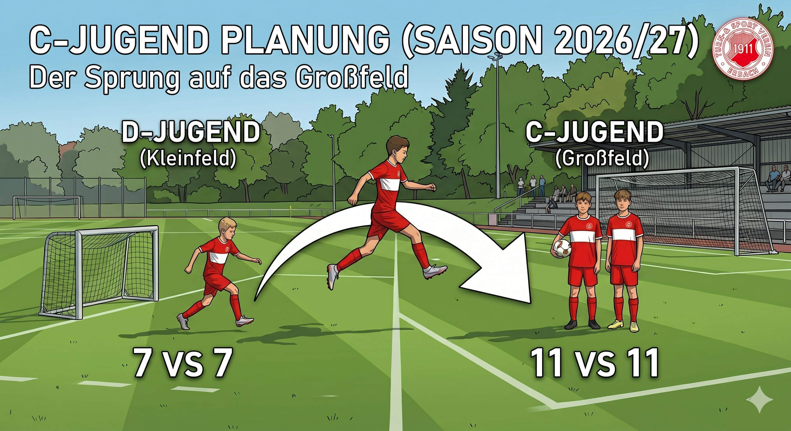
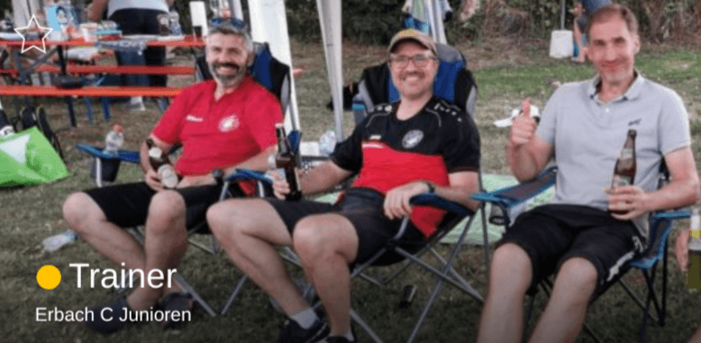
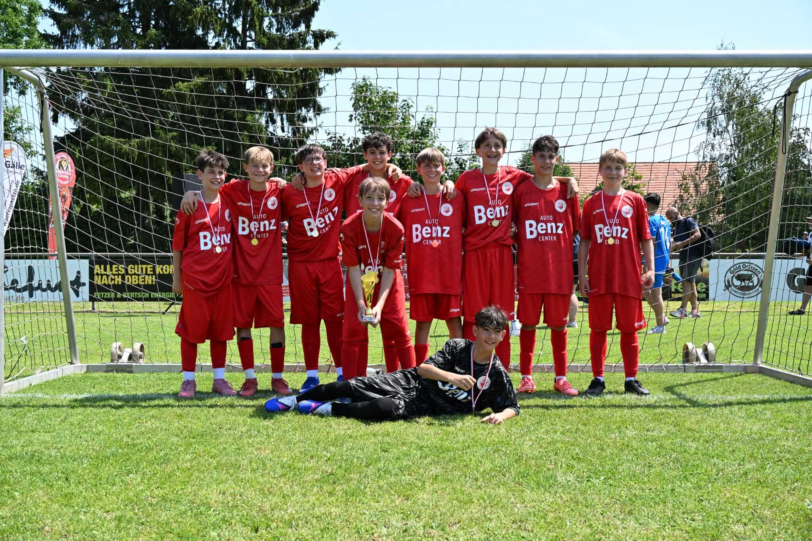
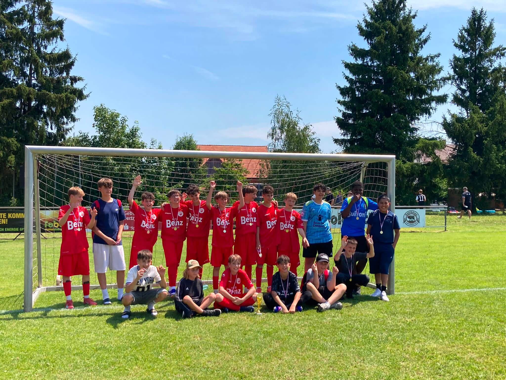
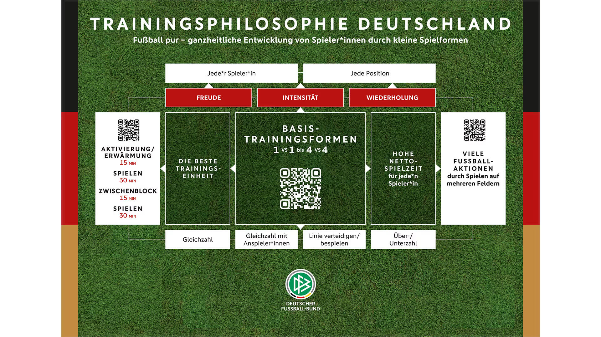
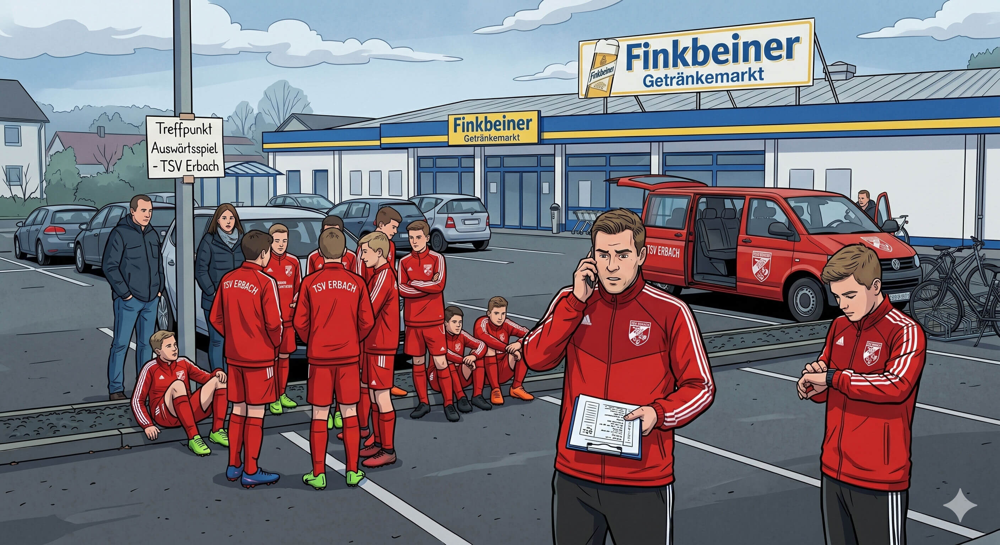

# Elternabend - C-Jugend Planung 2026/27

**Termin:** Donnerstag, 30.06.2026 | 19:30 – 21:00 Uhr

Diese Seite dient als strukturierter Leitfaden fuer den Elternabend zur Saison 2026/27.

## Agenda

1. Einstieg: D-Jugend -> C-Jugend
2. Trainerteam
3. Die Mannschaft
4. Training: Konzept, Tage und Zeiten
5. Teamorganisation
6. Abschluss: Fragen und Sonstiges

---

```{raw} latex
\newpage
```

## 1. Einstieg D-Jugend: Sprung in die C-Jugend



- Wechsel von Kleinfeld/Kompaktfeld auf Grossfeld
- Hoehere spielerische und organisatorische Anforderungen
- Ziel: sportlich und organisatorisch stabil in die neue Saison starten

```{raw} latex
\newpage
```

## 2. Trainerteam



- Trainerstab und Verantwortlichkeiten
- Erreichbarkeit und Kommunikation
- Zusammenarbeit zwischen Trainern und Eltern

```{raw} latex
\newpage
```

## 3. Die Mannschaft



- Eine eigenstaendige TSV Erbach C-Jugend Mannschaft als 11er Mannschaft
- Keine Spielgemeinschaft in der Saison 2026/27
- Training und Heimspiele finden in Erbach statt
- Fokus: klare Identitaet, kurze Wege, stabile Ablaeufe

### Kader (17 Kinder)

- **16 Kinder (Jahrgang 2013):** Hauptjahrgang der C-Jugend
- **1 Kind (Jahrgang 2012):** Uebergangsjahrgang



```{raw} latex
\newpage
```

## 4. Training: Konzept, Trainingstage und Zeiten



*Konzeptbezug:*
*[DFB Trainingsphilosophie Deutschland](https://www.dfb.de/mehr-fussball/dfb-akademie/trainingsphilosophie-deutschland).*

### Trainingskonzept

- Schrittweiser Uebergang von 7-gegen-7 auf 11-gegen-11
- Schwerpunkt auf Spielverstaendnis, Positionierung und Umschalten
- Altersgerechte Belastungssteuerung und Wiederholungsprinzipien

### Trainingstage und Zeiten

- Trainingstage und Uhrzeiten werden zu Saisonstart verbindlich festgelegt
- Planung orientiert sich an Platzverfuegbarkeit in Erbach
- Aenderungen werden fruehzeitig ueber Spond kommuniziert

```{raw} latex
\newpage
```

## 5. Teamorganisation



- Spond bleibt der verbindliche Kanal fuer Training, Spiele und Veranstaltungen
- Zu- und Absagen erfolgen ausschliesslich ueber Spond
- WhatsApp bleibt ein informeller Eltern-only-Kanal (z. B. Fahrgemeinschaften)
- Veranstaltungen wie Helferdienste, Abschlussfeiern und Turniere werden zentral in
 Spond geplant

```{raw} latex
\newpage
```

## 6. Abschluss: Fragen und Sonstiges

- Offene Fragen der Eltern sammeln und direkt klaeren
- Offene Punkte mit Verantwortlichkeiten und Termin versehen
- Naechste Schritte bis Saisonstart transparent festhalten

---

## Beschlussbild fuer den Elternabend

- Sportlicher Uebergang auf das Grossfeld ist gestartet
- C-Jugend 2026/27 wird beim TSV Erbach eigenstaendig organisiert
- Verbindliche Teamorganisation laeuft ueber Spond
