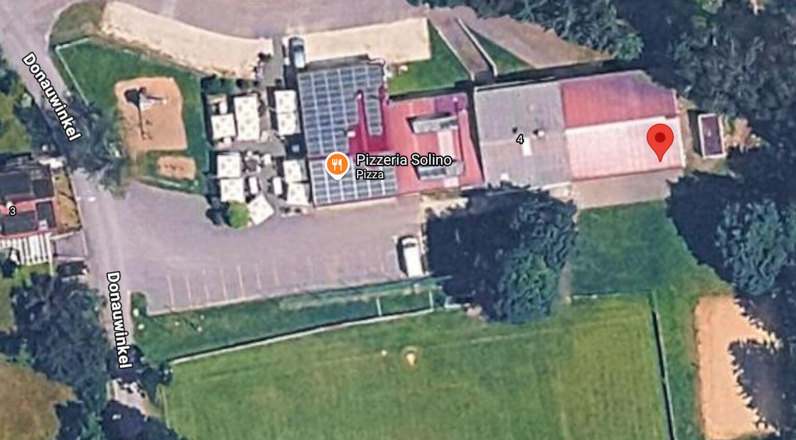

# Feldmarkierung & Equipment-Management

Herzlich willkommen zur Dokumentation der Feldmarkierung in der Jugendabteilung. Diese
Seite bietet einen strukturierten Überblick über die Organisation, Wartung und das
Management unserer Feldmarkierungsausrüstung.

Seit der Saison 2026/2027 liegt die Verantwortung für die Feldmarkierungsausrüstung und
Nassmarkierungsfarben in meinen Händen. Ich folge dabei auf unseren langjährigen
Vereinskollegen Josef, der die Aufgabe im Alter von über 70 Jahren übergeben hat.

## 📋 Dokumentation

```{toctree}
:maxdepth: 2
:caption: Feldmarkierung Organisation

Aufgaben & Zuständigkeiten <./aufgaben.md>
Praktische Checklisten <./checklisten.md>
Lagerverwaltung <./lagerverwaltung.md>
Wartungsplan & Termine <./wartung.md>
Schulung für Trainer <./schulung.md>
Galerie & Dokumentation <./galerie.md>
Probleme & Lösungen <./probleme-loesungen.md>
Problembeispiel Handhaspel <./problem-beispiel-handhaspel.md>
Praxisbericht Erstbestellung Nassfarbe <./praxisbericht-erstbestellung-nassfarbe.md>
```

## 🎯 Kurzübersicht

Die Feldmarkierung in der Jugendabteilung erfolgt dezentralisiert durch die Trainer
selbst. Um Qualität, Sicherheit und Langlebigkeit unserer Ausrüstung zu gewährleisten,
haben wir folgende Bereiche definiert:

- **Wartung & Instandhaltung:** Handhaspel, Messschnüre, Streuwagen
- **Logistik & Einkauf:** Bestandsverwaltung, Bestellungen, Lieferabwicklung
- **Infrastruktur:** Fass-Management, Lagerung, Ordnung
- **Schulung:** Richtige Nutzung des Equipments durch alle Trainer
- **Monitoring:** Regelmäßige Wartung nach Zeitplan

Ziel ist es, eine transparente, verteilte Verantwortung zu schaffen und die Kultur
der offenen Kommunikation zu stärken, damit Defekte schnell gemeldet und behoben
werden können.

## 🔗 Wichtige Kontakte & Informationen

- **Feldmarkierungs-Koordinator (Hausmeister):** Michael Weitner
- **Lagerort Equipment:** Geräteraum / Geräte-Garage
   ([Google Maps](https://maps.app.goo.gl/5xtcYw473QL7cjS59))
- **Notfall-Reparatur:** email: <michael@weitner.io>, handy: +49 170 7014698

### Lagerort (Übersicht)


