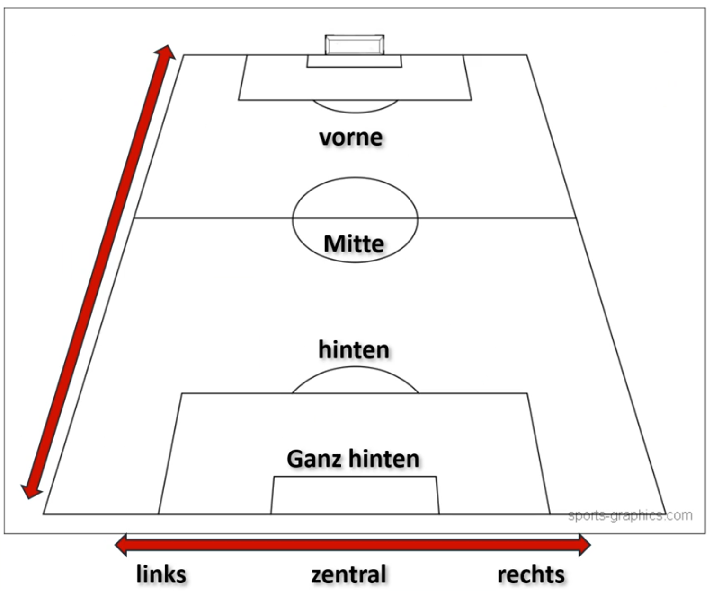
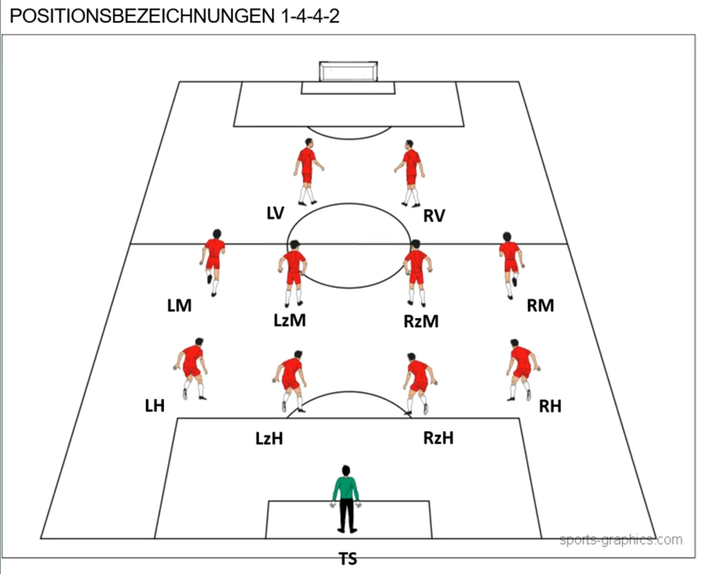

# BOS Spielfeld und Positionen

Diese Seite zeigt die Ortssprache der Ballorientierten Spielphilosophie (BOS)
auf dem Feld: von ganz hinten bis vorne, von links ueber zentral nach rechts
und als 1-4-4-2-Grundordnung.

## Die Grundlogik

- Tiefe: ganz hinten -> hinten -> Mitte -> vorne
- Breite: links -> zentral -> rechts
- Reihen: 1. Spiel-Reihe, 2. Spiel-Reihe, 3. Spiel-Reihe, 4. Spiel-Reihe

## Grafik

Breite und Tiefe

Positionen im 1-4-4-2

## 1-4-4-2 im BOS

Vom eigenen Tor aus gelesen:

| Reihe | Raum | Positionen |
| --- | --- | --- |
| 1. Reihe | ganz hinten | Torspieler (TS) |
| 2. Reihe | hinten | Links-Hinten (LH), Links-zentral-Hinten (LzH), Rechts-zentral-Hinten (RzH), Rechts-Hinten (RH) |
| 3. Reihe | Mitte | Links-Mitte (LM), Links-zentral-Mitte (LzM), Rechts-zentral-Mitte (RzM), Rechts-Mitte (RM) |
| 4. Reihe | vorne | Links-Vorne (LV), Rechts-Vorne (RV) |

## Legende

- Torspieler (TS)
- Links-Hinten (LH)
- Links-zentral-Hinten (LzH)
- Rechts-zentral-Hinten (RzH)
- Rechts-Hinten (RH)
- Links-Mitte (LM)
- Links-zentral-Mitte (LzM)
- Rechts-zentral-Mitte (RzM)
- Rechts-Mitte (RM)
- Links-Vorne (LV)
- Rechts-Vorne (RV)

## Merksatz

Positionen im BOS beschreiben primaer den Ort auf dem Feld. Die Rolle im Spiel
ergibt sich aus der Situation, nicht nur aus der Bezeichnung.
